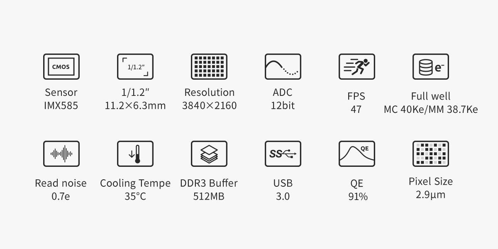
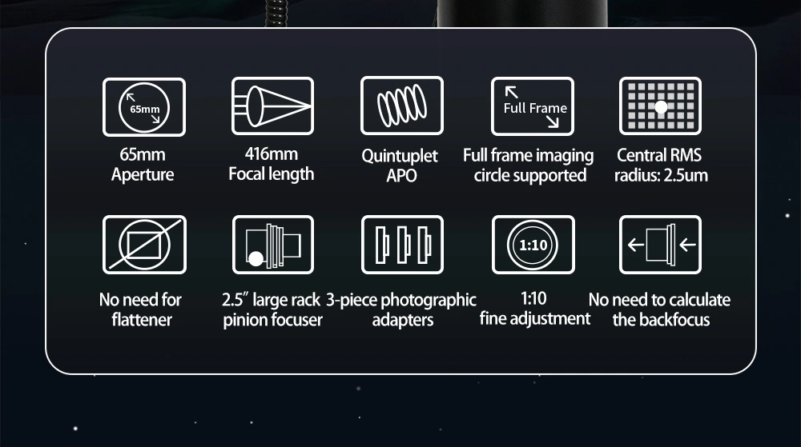

# GalSim_Training_Data
This repository contains a high-performance, multi-core astrophotography simulation pipeline. It uses European Space Agency (ESA) Gaia DR3 data to synthesize mathematically perfect starfields tailored to specific optical hardware (e.g., ASI294MM sensor, 200mm lens).

🛠️ Installation & Setup
This project requires a Conda environment (Miniforge/Miniconda) to properly handle the complex C++ astronomical dependencies required by GalSim.

Step 1: Create a Dedicated Environment
It is highly recommended to isolate these packages to prevent dependency conflicts.

Bash

# Install conda for linux arm
```
wget https://github.com/conda-forge/miniforge/releases/latest/download/Miniforge3-Linux-aarch64.sh
bash Miniforge3-Linux-aarch64.sh
```

# Accept Terms of Service
```
conda tos accept --override-channels --channel https://repo.anaconda.com/pkgs/main
conda tos accept --override-channels --channel https://repo.anaconda.com/pkgs/r
```
# Create a new environment named 'galsim_env' running Python 3.10
```
conda create -n galsim_env -c conda-forge python=3.10 galsim astropy astroquery pandas matplotlib numpy -y
```
# Activate the environment
```
conda activate galsim_env
```
Step 2: Install Required Packages
Run the following command to install the entire pipeline in one go from the conda-forge channel. This ensures all C++ binaries are correctly compiled for the Raspberry Pi's ARM architecture.

# Building Star Catalog
Bash
```
python src/build_cache_GAIADR3.py
```

Technical Specs of Hardware Simulated:
Sensor: ZWO ASI585MM Pro - https://www.zwoastro.com/product/asi585mc-mm-pro/

Lens: ZWO FF65 APO - https://www.zwoastro.com/product/zwo-ff65-apo/

